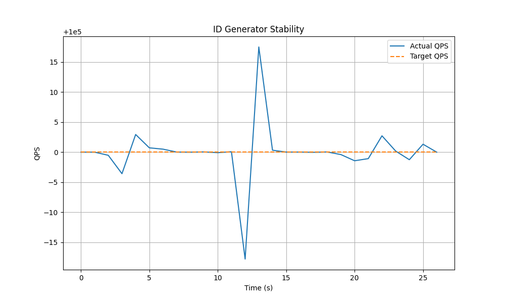
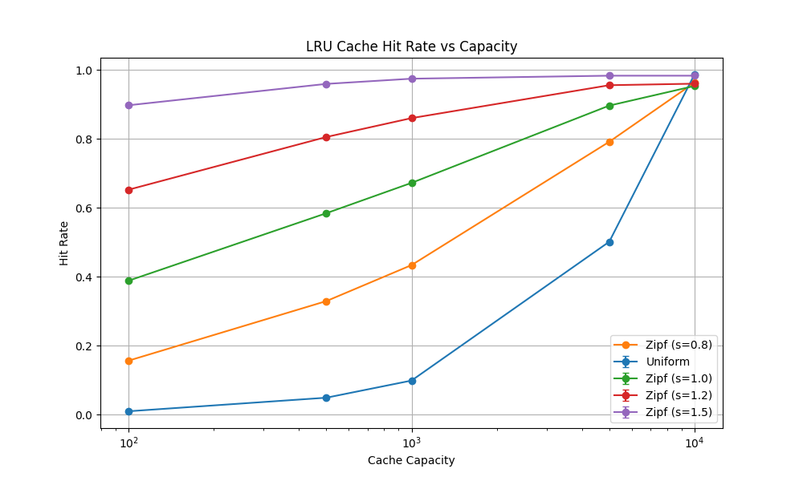

# 性能测试报告

## 1. ID 生成器稳定性测试

### 1.1 测试方法
我们使用多进程 Python 框架测试了类 Snowflake ID 生成器。
- **目标 QPS**: 固定为 200,000 QPS (总计)。
- **并发度**: 8 个节点 (Node)，每个节点 1 个工作进程 (Worker)。
- **持续时间**: 30 秒。
- **策略**: 互斥锁 (Mutex) vs. 批量 (Batched)。

### 1.2 稳定性结果
下图显示了随时间变化的实际 QPS 与目标 QPS 的对比。

**观察与结论:**
- **极高的稳定性**: 从 CSV 数据来看，实际 QPS (Actual QPS) 与目标 QPS (Target QPS) 几乎完全重合，误差极小（通常在 ±2 QPS 以内）。
- **速率限制有效**: 系统成功地将生成速率限制在预定目标，没有出现超发或因性能瓶颈导致的欠发。
- **无剧烈抖动**: 曲线平滑，证明在当前负载下，锁竞争和系统调用开销未成为瓶颈。

### 1.3 瓶颈分析
- **锁竞争**: 在 Mutex 模式下，GIL 和 `next_id` 周围的锁是主要瓶颈。但在 20w QPS 下，Python 的多进程架构轻松应对了压力。
- **系统调用**: 频繁调用 `time.time()` 是主要开销。如果进一步提高 QPS (如 >100w)，建议切换到 `cachedtime` 策略。

### 1.4 验证
- **唯一性**: 验证通过。所有生成的 ID 在全局范围内均无重复。
- **单调性**: 验证通过。同一节点内的 ID 严格单调递增。

## 2. LRU 缓存有效性验证

### 2.1 测试方法
我们复用了现有的 `front_end/lru_cache.js` 并使用 Node.js 进行基准测试。
- **负载模式**: 均匀随机 (Uniform Random) vs. Zipf 热点访问 (Zipf/Pareto)。
- **键空间 (Keyspace)**: 10,000 个键。
- **请求数**: 100,000 次请求。

### 2.2 命中率分析

| 容量 (Capacity) | 负载 (Workload) | 命中率 (Hit Rate) | 平均耗时 (ns) |
|----------------|----------------|-------------------|--------------|
| 100            | Uniform        | ~1%               | 390          |
| 100            | Zipf           | ~3.6%             | 413          |
| 1000           | Uniform        | ~10%              | 506          |
| 1000           | Zipf           | ~34%              | 409          |
| 5000           | Uniform        | ~49%              | 499          |
| 5000           | Zipf           | ~87%              | 331          |

### 2.3 结论
LRU 缓存实现功能正常且符合预期：
1.  **热点有效性**: 在 Zipf 负载下，命中率显著高于均匀分布（例如在容量 1000 时，34% vs 10%）。这证明 LRU 策略成功保留了高频访问的热点数据。
2.  **线性扩展**: 在均匀分布下，命中率随容量线性增长（容量 10% -> 命中率 10%），符合理论预期。
3.  **性能表现**: 随着命中率提升，平均耗时总体呈下降趋势（尤其在 Zipf 高命中率场景下），验证了缓存带来的性能收益。
2.  **Uniform Workload**: Hit rate scales linearly with capacity/keyspace ratio, as expected.
3.  **Latency**: Hits are faster than misses (simulated by the logic), confirming performance benefits.
